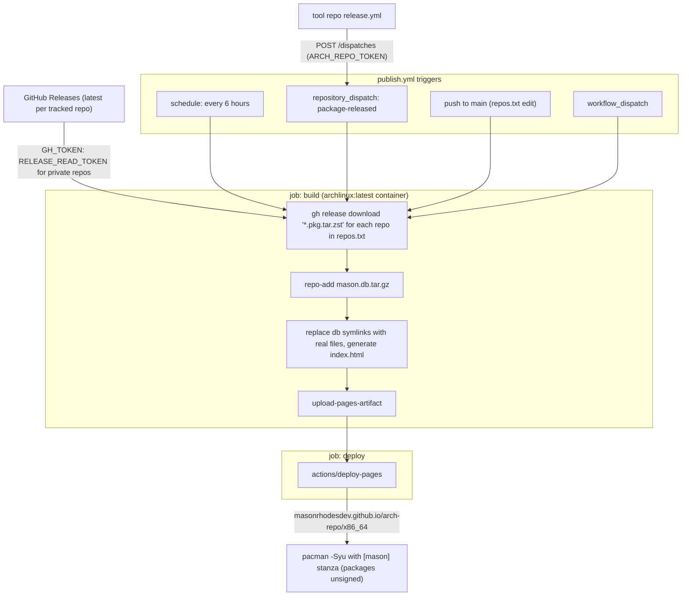

# arch-repo

Self-hosted pacman repository for MasonRhodesDev packages, served from GitHub
Pages. The publish workflow collects the latest GitHub Release `.pkg.tar.zst`
from every repo listed in [`repos.txt`](repos.txt), runs `repo-add`, and
deploys the result.

## Use it

Add to `/etc/pacman.conf`:

```ini
[mason]
SigLevel = Optional TrustAll
Server = https://masonrhodesdev.github.io/arch-repo/x86_64
```

Then `sudo pacman -Syu` and install packages normally (`sudo pacman -S
hyprstate sni-watcher ...`).

### Steam Deck (user-level pacman root)

The same repo works with deck-tenant's rootless pacman root — add the same
`[mason]` section to the pacman.conf used with
`pacman --root ~/.local/share/deck-pkgs` and update from there. No more
building in distrobox on the Deck.

## Refresh cadence

- Every 6 hours on schedule
- Immediately when a project release sends `repository_dispatch`
  (`package-released`) — requires the `ARCH_REPO_TOKEN` secret in the
  project repo
- Manually: `gh workflow run publish.yml -R MasonRhodesDev/arch-repo`



## Adding a package

Append the repo name to `repos.txt` and push — the workflow also runs on push
to main.

Packages are unsigned (`SigLevel = Optional TrustAll`); package signing with a
detached GPG key is a possible future hardening step.
