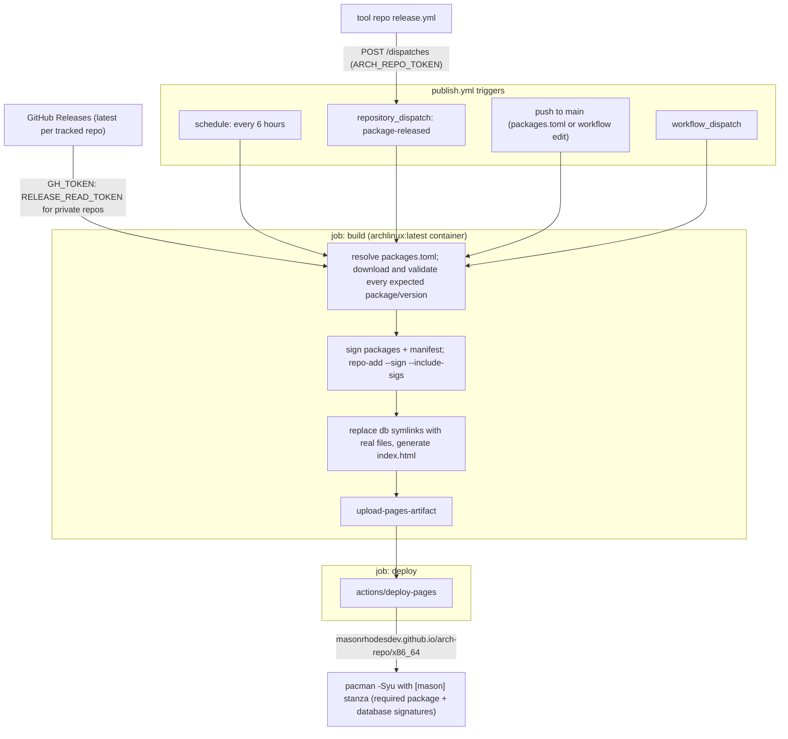

# arch-repo

Self-hosted pacman repository for MasonRhodesDev packages, served from GitHub
Pages. The publish workflow resolves every release in
[`packages.toml`](packages.toml), requires the exact declared package set and
release version, signs the packages and repository database, and deploys the
result atomically.

## Use it

Import and locally trust the dedicated repository key:

```bash
curl -fsSLo /tmp/mason-repo.asc \
  https://masonrhodesdev.github.io/arch-repo/mason-repo.asc
test "$(gpg --show-keys --with-colons /tmp/mason-repo.asc |
  awk -F: '$1 == "fpr" { print $10; exit }')" = \
  "41450EEF8CEE7AB8CD3896221284404A6B70485C"
sudo pacman-key --add /tmp/mason-repo.asc
sudo pacman-key --lsign-key 41450EEF8CEE7AB8CD3896221284404A6B70485C
rm /tmp/mason-repo.asc
```

Then add to `/etc/pacman.conf`:

```ini
[mason]
SigLevel = Required DatabaseRequired
Server = https://masonrhodesdev.github.io/arch-repo/x86_64
```

Then `sudo pacman -Syu` and install packages normally (`sudo pacman -S
hyprstate sni-watcher ...`).

### Steam Deck (user-level pacman root)

The same repo works with deck-tenant's rootless pacman root — add the same
`[mason]` section to the pacman.conf used with
`pacman --root ~/.local/share/deck-pkgs` and update from there. No more
building in distrobox on the Deck.

## hyprland-git channel

`git-builds.yml` builds a lockstep pair every 6 hours (skipping when
hyprwm/Hyprland main hasn't moved): **hyprland-git** (upstream main against
extra/'s stable hypr* libraries — when main starts needing an unreleased
library the build fails visibly; extend `pkgbuilds/hyprland-git` then) and
**hyprland-workspace-zones-git** (the workspace-zones plugin built in the
same job, so its API hash matches that exact compositor build, pinned
`hyprland-git=<version>`). The pair is published as a `v<pkgver>` release on
this repo — `packages.toml` tracks it like any other project — and old git
releases are pruned to the newest 3. Install with
`pacman -S hyprland-git hyprland-workspace-zones-git`; the plugin
provides/conflicts the stable `hyprland-workspace-zones`, so
waybar-workspace-buttons' dependency stays satisfied.

## Refresh cadence

- Every 6 hours on schedule
- Immediately when a project release sends `repository_dispatch`
  (`package-released`) — requires the `ARCH_REPO_TOKEN` secret in the
  project repo
- Manually: `gh workflow run publish.yml -R MasonRhodesDev/arch-repo`


```mermaid
flowchart TD
    subgraph triggers ["publish.yml triggers"]
        cron["schedule: every 6 hours"]
        dispatch["repository_dispatch: package-released"]
        push["push to main (packages.toml or workflow edit)"]
        manual["workflow_dispatch"]
    end

    subgraph build ["job: build (archlinux:latest container)"]
        download["resolve packages.toml; download and validate every expected package/version"]
        sign["sign packages + manifest; repo-add --sign --include-sigs"]
        copy["replace db symlinks with real files, generate index.html"]
        artifact["upload-pages-artifact"]
    end

    subgraph deploy ["job: deploy"]
        deploypages["actions/deploy-pages"]
    end

    release["tool repo release.yml"] -->|"POST /dispatches (ARCH_REPO_TOKEN)"| dispatch
    releases["GitHub Releases (latest per tracked repo)"] -->|"GH_TOKEN: RELEASE_READ_TOKEN for private repos"| download
    cron --> download
    dispatch --> download
    push --> download
    manual --> download
    download --> sign --> copy --> artifact
    artifact --> deploypages
    deploypages -->|"masonrhodesdev.github.io/arch-repo/x86_64"| client["pacman -Syu with [mason] stanza (required package + database signatures)"]
```

## Adding a package

Add a `[[release]]` entry to `packages.toml`, including every expected package
name. Publication fails instead of serving a partial, stale, unexpected, or
unsigned package set.

The signing fingerprint is committed in `signing-fingerprint.txt`. The
private CI-only key is stored only as the `PACKAGE_SIGNING_KEY` Actions secret
and expires in August 2028; rotate it before expiry and publish a migration
notice before changing the trusted fingerprint.
